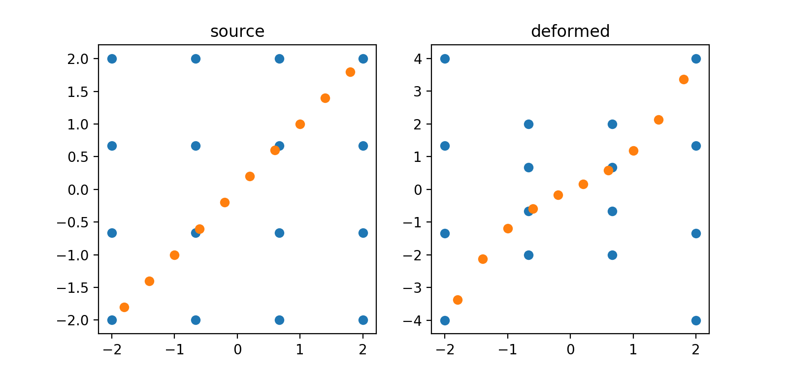

# TPS deformation

Python implementation of [thin plate spline] function.

Rewrite from [daeyun/TPS-Deformation], which was originally matlab code.


[thin plate spline]: https://en.wikipedia.org/wiki/Thin_plate_spline
[daeyun/TPS-Deformation]: https://github.com/daeyun/TPS-Deformation


## Usage

Use `tps.find_coefficients` to get coefficients, and then you can transform other points from source surface to the deformed surface by using `tps.tps.transform`. Or one could use the shortcut `tps.TPS` (see example below).

Both 2D and 3D points are supported. **Noted** the points should be in N by 2 or N by 3 matrix.


***Example***

```py
samp = np.linspace(-2, 2, 4)
xx, yy = np.meshgrid(samp, samp)

# make source surface, get uniformed distributed control points
source_xy = np.stack([xx, yy], axis=2).reshape(-1, 2)

# make deformed surface
yy[:, [0, 3]] *=2
deform_xy = np.stack([xx, yy], axis=2).reshape(-1, 2)

# get coefficient, use class
trans = tps.TPS(source_xy, deform_xy)

# make other points a left-bottom to upper-right line on source surface
samp2 = np.linspace(-1.8, 1.8, 10)
test_xy = np.tile(samp2, [2, 1]).T

# get transformed points
transformed_xy = trans(test_xy)
```


